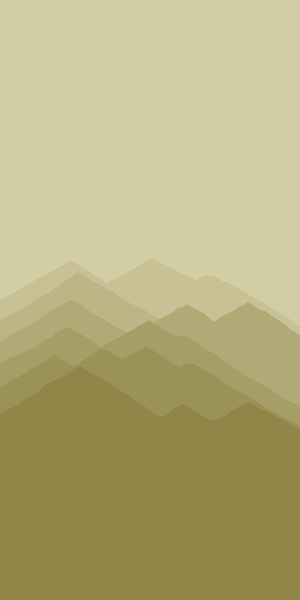
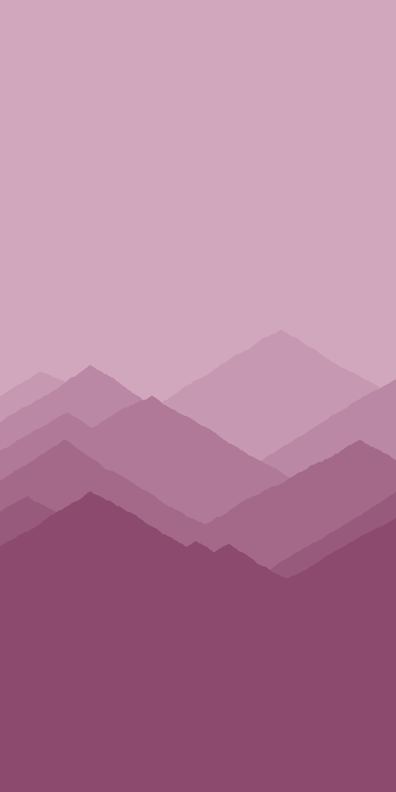
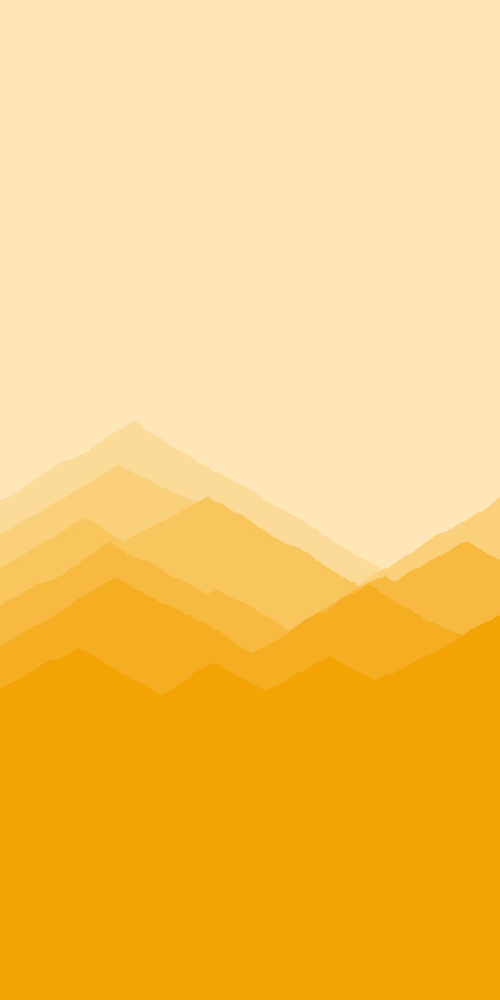

# Colourful Mountains.

This is a Processing application to create colourful vector mountainscape images from input text. The purpose is to create printed artwork with the input text manually edited onto the top. However, they're also nice without any editing. 

# How to run

First install Processing (tested with Processing 3). Next, clone or download the repository. 

To change anything, you'll need to edit the code. Feel free to run the program in Processing's "tweak" mode to edit the colours during runtime. 

# Samples

These samples were created with various input text.

  
   
