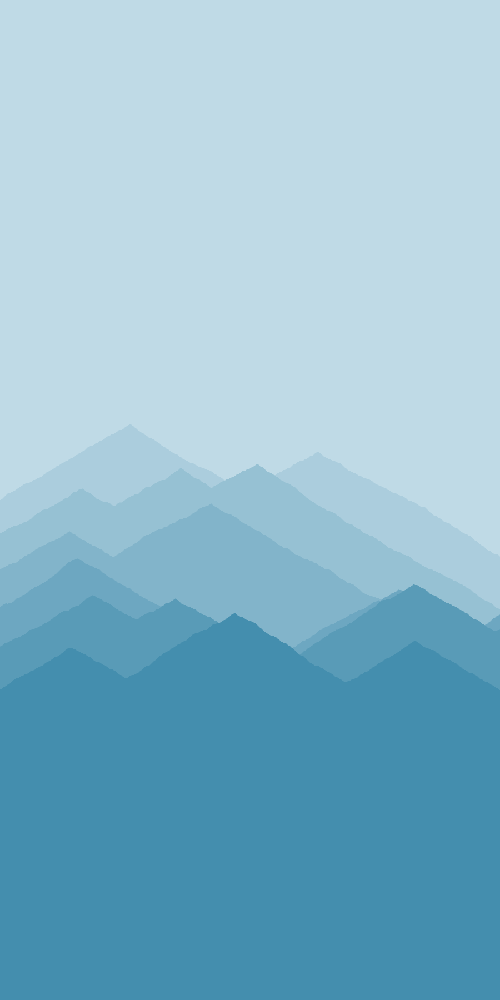
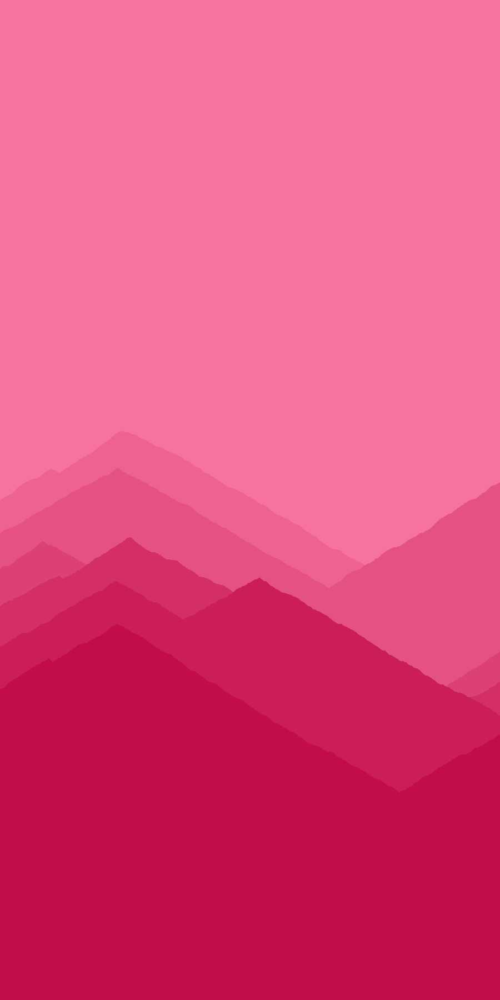
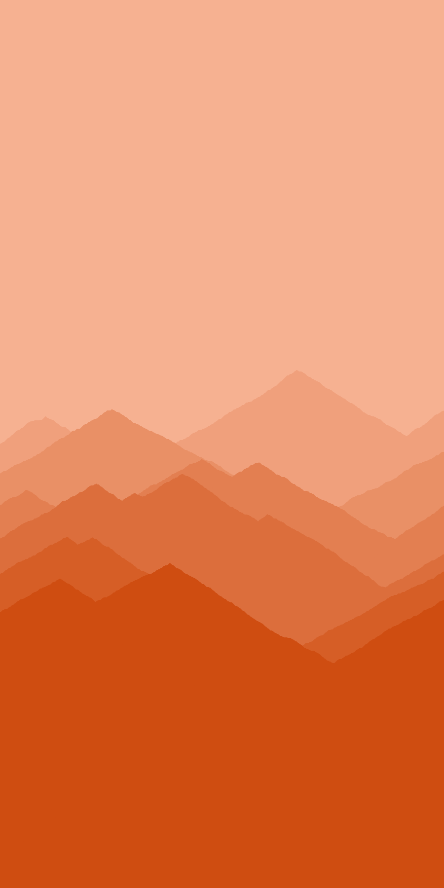

# Colourful Mountains.
This is a Processing application to create colourful vector mountainscape images from input text. The purpose is to create printed artwork with the input text manually edited onto the top. However, they're also nice without any editing. 

# Samples

These samples were created with various input text.

  
   
